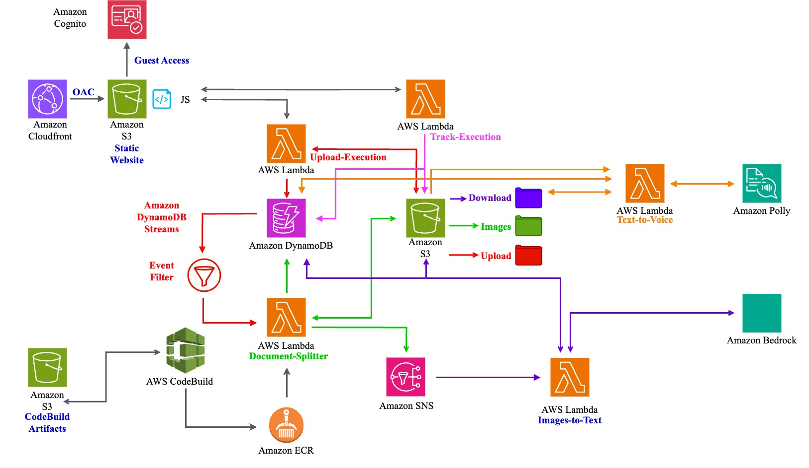

# Project VocalDocs

VocalDocs is a solution that converts PDF documents into audio files using Serverless Event Driven Architecture on AWS. This repository contains all the necessary code and Terraform infrastructure as code (IaC) to deploy the solution.

## Architecture


## Repository HL Structure
**CodeBuild Artifacts**: Contains the necessary files to build the Docker image for the PDFSplitter Lambda function

**Lambda Functions**: Contains the deployment packages for all Lambda functions used in the solution

**Static Website**: Contains the frontend files for the user interface

**Terraform Project**: Contains all IaC files to deploy the required AWS resources

## Repository Detailed Structure
```plaintext
vocaldocs repo
├── images
│   ├── architecture.jpg
├── README.md
└── project vocaldocs
    ├── CodeBuild_Artifacts
    │   ├── Dockerfile
    │   ├── lambda_function
    │   └── requirements
    ├── Lambda_Function
    │   ├── ImageConverter.zip
    │   ├── PollyInvoker.zip
    │   ├── upload-execution.zip
    │   └── track-execution.zip
    ├── Static Website
    │   ├── index.html
    │   ├── script.js
    │   └── style.css
    └── Terraform Project
        ├── main.tf
        ├── outputs.tf
        ├── terraform.tfvars
        └── variables.tf
```
       
## Prerequisites

Before deploying this solution, ensure you have:

1. AWS CLI installed and configured with appropriate credentials
2. Terraform installed (version 0.12 or later)
3. Amazon Bedrock LLM (Claud 3.5) enabled in your target AWS region
4. Amazon Polly service available with required languages in your target region
5. Git installed on your local machine

## Getting Started

### Clone the Repository

```bash
git clone https://github.com/aymenfarag/vocaldocs.git
cd vocaldocs
```
Deploy the Infrastructure

Navigate to the Terraform project directory:
```bash
cd "project vocaldocs/Terraform Project"
```

Initialize Terraform:
```bash
terraform init
```

Review the planned changes:
```bash
terraform plan
```

Apply the infrastructure:
```bash
terraform apply
```

### Lambda Functions
1. **upload-execution**

    Frontend

    Part of New Request Function static website flow

    Invocation: From static website Javascript with Cognito

    Goal: This lambda function will upload the pdf document to S3 bucket under prefix upload/ then will save the metadata to a Dynamo_db table

    Deployment: As part of Terraform deployment, you deploy the lambda .zip file
2. **track-execution**

    Frontend

    Part of Track Existing Request Function static website flow

    Invocation: From static website Javascript with Cognito

    Goal: This lambda function will check the Dynamo_db table and retrieve all the ready voice for all uploaded documents by that user and it will create a pre-signed url for the user

    Deployment: As part of Terraform deployment, you deploy the lambda .zip file
3. **PDFSplitter-CONTAINER**

    Backend 

    Part of New Request Function static website flow 

    Invocation: From Dynamo DB Stream "If New Raw Added" 

    Goal: PDF to Image conversion 

    Deployment: As part of Terraform deployment, you deploy CodeBuild artifact to build the image that will be used to run this lambda function
4. **ImageConverter**

    Backend 

    Part of New Request Function static website flow 

    Invocation: From SNS Integration with Topic:Images-Text-BedrockInvoker

    Goal: Initiate API call with LLM model to convert each image to a clear text 

    Deployment: As part of Terraform deployment, you deploy the lambda .zip file
5. **PollyInvoker**

    Backend 

    Part of New Request Function static website flow 

    Invocation: From S3 event notification if there is new .txt file is uploaded to S3 bucket under prefix download/

    Goal: Initiate API call with Polly to read the final text file into the selected language

    Deployment: As part of Terraform deployment, you deploy the lambda .zip file


**Feel free to submit issues and enhancement requests!**

Contact [aymanahmad@gmail.com]
License [Specify your license here]

## Detailed Deployment Instructions

## Troubleshooting Steps 

## Architecture Details & Flow 


