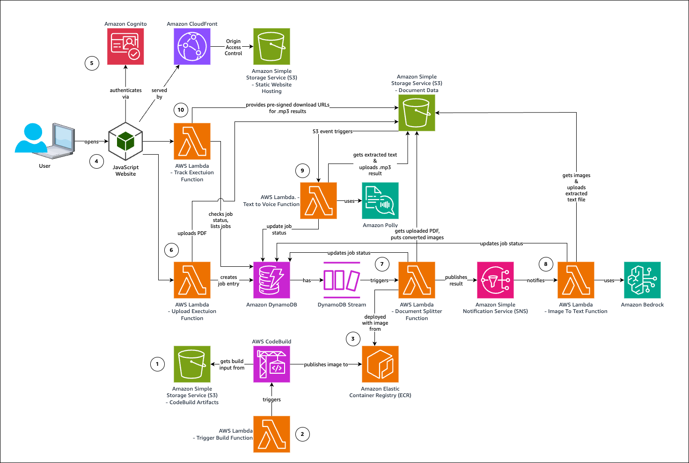

# Project VocalDocs

VocalDocs is a solution that converts PDF documents into audio files using Serverless Event Driven Architecture on AWS. This repository contains all the necessary code and Terraform infrastructure as code (IaC) to deploy the solution.

## Architecture


### Architecture Walkthrough

1. During `terraform apply` deployment, assets are uploaded to the build artifacts Simple Storage Service (S3) bucket.
2. An AWS Lambda function triggers an AWS CodeBuild project that builds the container image for the Document Splitter function and stores it in the Amazon Elastic Container Registry (ECR).
3. The Document Splitter AWS Lambda function is deployed using the image from ECR.
4. After deployment, a user loads the website via the Amazon CloudFront domain url, which serves the static website content from the associated Amazon S3 bucket.
5. The user authenticates via Amazon Cognito and receives temporary credentials for interacting with the service AWS Lambda functions.
6. Via the website UI, the user uploads a PDF document to the Upload Execution AWS Lambda function. It creates a job entry in the Amazon DynamoDB table and stores the PDF in the Document Data Amazon S3 bucket.
7. The new job entry in the Amazon DynamoDB table is processed by the associated DynamoDB Stream which triggers the Document Splitter function. It converts the pages of the document it got from the Amazon S3 bucket to images, stores them back in it, updates the job status in the Amazon DynamoDB table and sends a notification to an Amazon Simple Notification Service (SNS) topic.
8. The Image To Text AWS Lambda function is subscribed to the SNS topic and triggered with the notification. It uses Amazon Bedrock to extract the text from the images it got from the Amazon S3 bucket and puts the result back into it.
9. An Amazon S3 event notification triggers the Text To Voice AWS Lambda function which gets the text file from the bucket, uses Amazon Polly to convert it to an audio file in MP3 format and stores it back in the bucket.
10. Navigating to the Existing Requests page in the UI, the website triggers the Track Execution AWS Lambda function. It lists all jobs including their current status and provides pre-signed URLs for the audio files of the finished jobs for downloading the MP3 files and playing them directly in supported browsers.

## Prerequisites

Before deploying this solution, ensure you have:

1. [AWS CLI](https://docs.aws.amazon.com/cli/latest/userguide/getting-started-install.html) installed and configured with appropriate credentials
1. [Terraform](https://developer.hashicorp.com/terraform/install) installed (version 1.12 or later)
1. [Git](https://git-scm.com/) installed on your local machine
1. Amazon Bedrock LLM (Claude 4.5 Sonnet) enabled in your target AWS region ([check for region availability](https://docs.aws.amazon.com/bedrock/latest/userguide/models-regions.html))
1. Amazon Polly service with required languages [available in your target region](https://docs.aws.amazon.com/general/latest/gr/pol.html)

## Getting Started

### Clone the Repository

```bash
git clone git@github.com:aymenfarag/vocaldocs.git
cd vocaldocs
```

### Deploy the Infrastructure

Navigate to the Terraform project directory:
```bash
cd "src/terraform_project"
```

Initialize Terraform:
```bash
terraform init
```

Review the planned changes:
```bash
terraform plan
```

Apply the infrastructure:
```bash
terraform apply
```

Open the Amazon CloudFront URL this command produces as last output (`website_url =`) in your browser.

### Create an Amazon Cognito User

In another tab, navigate to the [Amazon Cognito User Pools page](https://console.aws.amazon.com/cognito/v2/idp/user-pools) in the AWS Console. Ensure that you are in the region you deployed the solution to. You will find a user pool starting with `vocaldocs-user-pool`, choose it.

In the left hand navigation pane under **User Management**, choose **Users**. Choose the **Create user** button and create your user.

Return to the application tab and log in with your newly created user.

### User Flow

1. Users access the website through the CloudFront distribution URL.
2. Before accessing any features, users must authenticate using Cognito User Pools.
3. Once authenticated, users can:
   - Submit new TTS requests
   - Track existing requests they've previously submitted

#### Submitting a New Request
1. User navigates to the `new-request.html` page.
2. User uploads a PDF file (max 5MB).
3. User selects the document language (currently English or Arabic).
4. User specifies the starting and ending page ranges.
5. User submits the request.

#### Backend Processing
1. The document is uploaded to an S3 bucket.
2. A new record is created in DynamoDB with job details and S3 object location.
3. DynamoDB Streams trigger a Lambda function (PDF Splitter) when new records are inserted.
4. PDF Splitter:
   - Retrieves the document from S3
   - Splits the PDF into individual pages
   - Extracts the specified page range
   - Converts pages to images
   - Publishes a message to an SNS topic upon completion
5. A second Lambda function (Images-to-Text) is triggered by the SNS message.
6. Images-to-Text:
   - Processes images sequentially
   - Sends each image to Amazon Bedrock (Claude Sonnet 4.5) for text extraction
   - Concatenates extracted text from all pages
   - Writes the formatted text file back to S3
7. S3 event notification triggers the third Lambda function (Text-to-Voice) when a new .txt file is created.
8. Text-to-Voice:
   - Retrieves the formatted text file from S3
   - Passes the text to Amazon Polly for text-to-speech conversion
   - Writes the resulting audio file back to S3
   - Updates the DynamoDB record to indicate "Voice-is-ready"

#### Tracking Requests
1. User navigates to the `track-requests.html` page.
2. This triggers a Lambda function to fetch records from DynamoDB for the authenticated user.
3. The function returns the status of all jobs submitted by the user.
4. If a job is complete (Voice-is-ready), the user is presented with an option to play the audio file.

## Troubleshooting Steps 

In case of any issues, you can check developer tools logs, aws cloudwatch logs for all the components in the solution to troubleshoot the issue

Also, there are some quick checkpoints that can help you debug the flow and figure out where it has been stopped, check those checkpoints:

- document-request-bucket prefix upload/ : If the document upload is completed successfully, you should find a new uploaded object in this prefix under the reference_key, also you should find a new entry in the Dynamo Database Table : Document_Request_db
- document-request-bucket prefix images/ : If PDF to Image conversion flow (by lambda: PDFSplitter-CONTAINER) is completed successfully, you should find the images exist in this prefix under the reference_key
- document-request-bucket prefix download/ : If the Image to Text conversion flow (by lambda: ImageConverter) is completed successfully, you should find the output text in this prefix under the reference_key 
- document-request-bucket prefix download/ : If the Text to Voice conversion flow (by lambda: PollyInvoker) is completed successfully, you should find the final audio file in this prefix under the reference key 

## Clean up

Delete the infrastructure:
```bash
terraform destroy
```

## Additional Technical Information

### Data Management
- DynamoDB table has TTL enabled, deleting records after 1 week.
- DynamoDB Streams are configured with a filter to trigger Lambda only on new record insertions.

### Security

- The S3 bucket is not directly accessible to users. All requests are routed through CloudFront.
- CloudFront is configured with Origin Access Control (OAC) to securely access the S3 bucket.
- User authentication is required before accessing any service features.

## Future Enhancements
- Support for additional document formats beyond PDF.
- Expansion of supported languages for document processing.

## Contact

Feel free to submit issues, feature requests and pull requests (see [contribution](./CONTRIBUTING.MD) and [development](./DEVELOPING.MD) information)!

For any other purposes, contact [Aymen Farag](aymenaly@amazon.ae) and [Walid Shehata Elsaid](wshehata@amazon.ae).

## License

This project is licensed under the terms of the MIT license.

